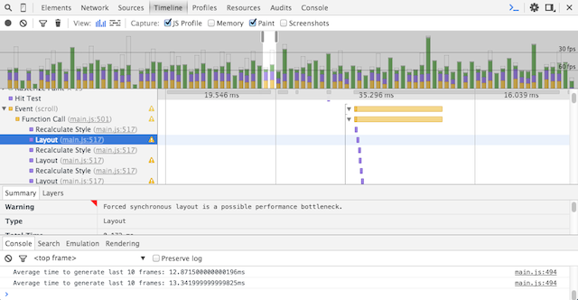
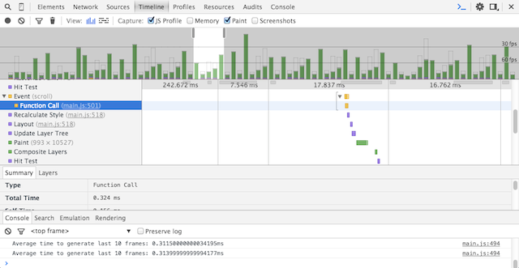
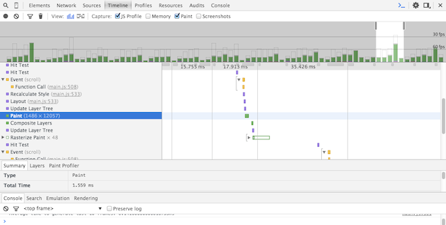
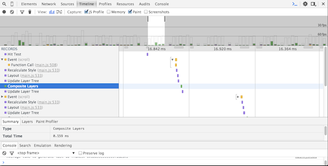
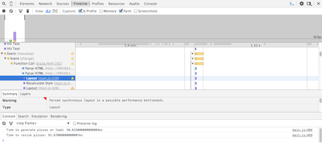
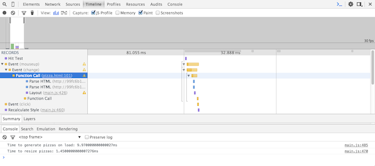

## Website Performance Optimization portfolio project

Your challenge, if you wish to accept it (and we sure hope you will), is to optimize this online portfolio for speed! In particular, optimize the critical rendering path and make this page render as quickly as possible by applying the techniques you've picked up in the [Critical Rendering Path course](https://www.udacity.com/course/ud884).

---
### How to Start

#### Start Part 1

Clone this repository onto your machine:

```
    $> git clone https://github.com/cg94301/frontend-nanodegree-mobile-portfolio.git
    $> cd frontend-nanodegree-mobile-portfolio/build/
    $> python -m SimpleHTTPServer 8080
    $> ngrok http 8080
```

Important: The optimized version for Pagespeed Insights is $root/build/index.html.

Open the URL displayed by ngrok (http version) in Google Pagespeed Insights at https://developers.google.com/speed/pagespeed/insights/.

#### Start Part 2

Open the URL displayed by ngrok (http version) in Google Chrome browser. Open developer tools. Click on the link for Cam's Pizzeria. Observe the reported page load time in the console. Scroll the page up and down. Observer the reported time to generate last 10 frames. Find the pizza size slider and resize pizzas. Observer time to resize pizzas in the console.

To get an even more detailed view switch to the Timeline tab in dev tools. Then record a timeline for each of the above steps and notice FPS in frames view.


### My Changes

NOTE TO SELF: To view this README.md offline, use Google Chrome extension Markdown Preview Plus from the Chrome Web Store. After installion check 'Allow access to file URLs' in chrome://extensions.

##### Comments
All changes made for this assignment are commented in the code. The comments have initials **cg**, e.g.
* HTML: `<!-- cg: ... some comment ... -->`
* JS: `// cg: ... some comment ...`
* JS: `/* cg: ... some comment ... */`

##### Directory Structure
Split this project into development version and production version. The development version is the original directory structure from Udacity git project frontend-nanodegree-mobile-portfolio. The production version has the same directory structure, but lives under the top-level build directory.

* Development version: $root/index.html
* Production version: $root/build/index.html

#### Part 1: My Changes to *Optimize PageSpeed Insights score for index.html*

The optimized version is the production version at build/index.html. This version should be used to check performance in Google Page Speed Insights.

##### Manually resize images

The original pizzeria.jpg is 2048x1536. This is way too large for displaying a simple thumbnail at top-level. Reduced size to 100x75 in pizzeria-smaller.jpg. This was done in MAC Preview. Image will be further optimzed via gulp image optimizer. See next step.

##### Minify Source Code and Optimize Images

Using GULP (A streaming build system) to automate the build flow. Gulp has great library support for optimization tasks like whitespace removal, inlining of code in HTML, image optimization among others. All of those mentioned are used here. See details in gulpfile.js, e.g. image optimization level is 5. 

* gulp-uglify (minimizes JS)
* gulp-minify-css
* gulp-minify-html
* gulp-inline-source
* gulp-image-optimization

The minified versions of all source files are saved under the build directory structure. The inlining option also does minimization on-the-fly. Image optimization is really only needed once. Therefore this is a separate target in gulp.

Optimize source code:
```
$> gulp
```

Optimize images:
```
$> gulp images
```

##### Selectively Inline JS and CSS in HTML
Inlining is simply done via the keyword **inline** in HTML. Like so: `<link href="css/style.css" rel="stylesheet" inline>`. See comments and keyword for where inlining was done in index.html.

##### Use asynchronous loading of lower priority scripts

If a script does not need to load immediately, simply use async keyword to delay load. For instance, use for Google Analytics, like so `<script async src="http://www.google-analytics.com/analytics.js"></script>`.

##### Asynchronously load Google web fonts via webfontloader

Cannot use async keyword for Google webfonts. Instead use webfontloader from https://github.com/typekit/webfontloader.git. Allows for asynchronous load of Google webfonts, like so `<script src="js/webfonts.js" inline></script>`. Where webfonts.js does this:

```javascript
WebFontConfig = {
    google: {families: ['Open Sans Condensed:400,700']}
};

(function(d) {
    var wf = d.createElement('script'), s = d.scripts[0];
    wf.src = 'https://ajax.googleapis.com/ajax/libs/webfont/1.5.18/webfont.js';
    s.parentNode.insertBefore(wf, s);
})(document);
```


#### Part 2: My Changes to *Optimize Frames per Second in pizza.html*

##### Manually resize images

The pizzeria.jpg is 2014x1536px originally, but displayed in the upper left corner at much smaller size. When resizing the viewport one can notice a layout change at 991px, where the pic changes to 100% viewport width. That means the largest this pic will ever be is 991px in width. Resize pic so it is that wide, while proportionally keeping height. This is done in Mac Preview. Result is pizzeria-small.jpg. The image is further optimzed via gulp image optimizer before loading.

##### Minor improvements by using faster selectors

Replace `docment.querySelectorAll('.class')` with `document.getElementsByClassName('class')`.

##### Improve scroll performance

###### Address Forced synchronous layout

The background pizzas move around when scrolling. The function that makes that happen is updatePositions. It loops through all background pizzas, which are identified by class mover. This loop in its original version causes a problem known as 'Forced synchronous layout'. This problem is flagged in dev tools timeline. It occurs when read and write accesses occur inside the loop. Here specifically the read document.body.scrollTop triggers a layout before scrollTop can be determined and $element.style.left is a write to DOM, requiring layout before read. The solution is to move the read outside the loop.

Here's a simple example describing this problem from http://gent.ilcore.com/2011/03/how-not-to-trigger-layout-in-webkit.html:
```javascript
      // Suboptimal, causes layout twice.
      var newWidth = aDiv.offsetWidth + 10; // Read
      aDiv.style.width = newWidth + 'px'; // Write
      var newHeight = aDiv.offsetHeight + 10; // Read
      aDiv.style.height = newHeight + 'px'; // Write

      // Better, only one layout.
      var newWidth = aDiv.offsetWidth + 10; // Read
      var newHeight = aDiv.offsetHeight + 10; // Read
      aDiv.style.width = newWidth + 'px'; // Write
      aDiv.style.height = newHeight + 'px'; // Write
```
Code before:
```javascript
    for (var i = 0; i < items.length; i++) {
        var phase = Math.sin((document.body.scrollTop / 1250) + (i % 5));
        items[i].style.left = items[i].basicLeft + 100 * phase + 'px';
    }
```


Code after:
```javascript
    var scrollpix = (document.body.scrollTop / 1250);
    for (var i = 0; i < items.length; i++) {
        var phase = Math.sin(scrollpix + (i % 5));
        items[i].style.left = items[i].basicLeft + 100 * phase + 'px';
    }
```



Further minor improvements can be achieved by doing this:

```javascript
    var phase = [];

    for (var i=0; i<5 ; i++) {
        phase.push(Math.sin(scrollpix + i ) * 100);
    }

    for (var i = 0; i < items.length; i++) {
        items[i].style.left = items[i].basicLeft + phase[i%5] + 'px';
    }
```

###### Promote elements to layers

Set CSS backface-visibility property to hidden. Helps to promote DOM elements to layers. This removes the paint step. The browser can also take adventage of GPU while rendering that element. There are few other CSS properties that do the same thing like translateZ(0) or translate3d(0,0,0). These are all hacks, and will be repalaced with new CSS property will-change.

(source: http://stackoverflow.com/questions/28511539/the-underlying-magic-of-webkit-backface-visibility)


Timeline with paint step:



Timeline after promotion w/o paint step:




#### Speedup Pizza resizing via slider

Inside the function resizePizzas is a loop that iterates through all pizzas to resize them when the slider has changed their size. Inside this loop the variable tht holds all random pizzas is repetitively generated with costly access to querySelectorAll(".randomPizzaContainer"). Move this access outside the loop with a single access to getElementsByClassName('randomPizzaContainer'). More importantly, move call determineDx and newwidth calculations outside the loop. They are only needed once. This avoids 'Forced synchronous layout' error.

Timeline before:



Timeline after:



#### Minor improvement to load performance

Minor improvements can be achieved by moving getElementById outside the loop:

From:

```javascript
for (var i = 2; i < 100; i++) {
    var pizzasDiv = document.getElementById("randomPizzas"); 
    pizzasDiv.appendChild(pizzaElementGenerator(i));
}
```

To:

```javascript
var pizzasDiv = document.getElementById("randomPizzas"); 
for (var i = 2; i < 100; i++) {
    pizzasDiv.appendChild(pizzaElementGenerator(i));
}
```

#### Doing math to reduce pizza count

The background pizza generator generates 200 pizzas. This seems excessive even for the largest displays. The pizza generator puts 8 pizzas per row. The rows are spaced 256px apart starting at row 0. A very high resolution 32" display is 3840x2160. If we want to cover the vertical resolution of 2160px we need 2160 / 256 = 8.43. So 8 rows + row 0 = 9 rows. That means 8 * 9 = 72 pizzas should suffice. With 72 pizzas we get these top positions per row: 0px, 256px, 512px, 768px, 1024px, 1280px, 1536px, 1792px, 2048px. 

This could be further optimized by calculating the number of visible rows going by the viewport height. Like so:

```javascript
   ...
   var height = window.innerHeight;
   var count = (Math.floor( height / 256 ) + 1) * 8;
   for (var i = 0; i < count; i++) {
   ...
```

Slight disadvantage of latter method is that a reload is required if the user resizes the window. 

#### End of My Changes
---
#### Udacity:

To get started, check out the repository, inspect the code,

### Getting started

####Part 1: Optimize PageSpeed Insights score for index.html

Some useful tips to help you get started:

1. Check out the repository
1. To inspect the site on your phone, you can run a local server

  ```bash
  $> cd /path/to/your-project-folder
  $> python -m SimpleHTTPServer 8080
  ```

1. Open a browser and visit localhost:8080
1. Download and install [ngrok](https://ngrok.com/) to make your local server accessible remotely.

  ``` bash
  $> cd /path/to/your-project-folder
  $> ngrok 8080
  ```

1. Copy the public URL ngrok gives you and try running it through PageSpeed Insights! Optional: [More on integrating ngrok, Grunt and PageSpeed.](http://www.jamescryer.com/2014/06/12/grunt-pagespeed-and-ngrok-locally-testing/)

Profile, optimize, measure... and then lather, rinse, and repeat. Good luck!

####Part 2: Optimize Frames per Second in pizza.html

To optimize views/pizza.html, you will need to modify views/js/main.js until your frames per second rate is 60 fps or higher. You will find instructive comments in main.js. 

You might find the FPS Counter/HUD Display useful in Chrome developer tools described here: [Chrome Dev Tools tips-and-tricks](https://developer.chrome.com/devtools/docs/tips-and-tricks).

### Optimization Tips and Tricks
* [Optimizing Performance](https://developers.google.com/web/fundamentals/performance/ "web performance")
* [Analyzing the Critical Rendering Path](https://developers.google.com/web/fundamentals/performance/critical-rendering-path/analyzing-crp.html "analyzing crp")
* [Optimizing the Critical Rendering Path](https://developers.google.com/web/fundamentals/performance/critical-rendering-path/optimizing-critical-rendering-path.html "optimize the crp!")
* [Avoiding Rendering Blocking CSS](https://developers.google.com/web/fundamentals/performance/critical-rendering-path/render-blocking-css.html "render blocking css")
* [Optimizing JavaScript](https://developers.google.com/web/fundamentals/performance/critical-rendering-path/adding-interactivity-with-javascript.html "javascript")
* [Measuring with Navigation Timing](https://developers.google.com/web/fundamentals/performance/critical-rendering-path/measure-crp.html "nav timing api"). We didn't cover the Navigation Timing API in the first two lessons but it's an incredibly useful tool for automated page profiling. I highly recommend reading.
* <a href="https://developers.google.com/web/fundamentals/performance/optimizing-content-efficiency/eliminate-downloads.html">The fewer the downloads, the better</a>
* <a href="https://developers.google.com/web/fundamentals/performance/optimizing-content-efficiency/optimize-encoding-and-transfer.html">Reduce the size of text</a>
* <a href="https://developers.google.com/web/fundamentals/performance/optimizing-content-efficiency/image-optimization.html">Optimize images</a>
* <a href="https://developers.google.com/web/fundamentals/performance/optimizing-content-efficiency/http-caching.html">HTTP caching</a>

### Customization with Bootstrap
The portfolio was built on Twitter's <a href="http://getbootstrap.com/">Bootstrap</a> framework. All custom styles are in `dist/css/portfolio.css` in the portfolio repo.

* <a href="http://getbootstrap.com/css/">Bootstrap's CSS Classes</a>
* <a href="http://getbootstrap.com/components/">Bootstrap's Components</a>

### Sample Portfolios

Feeling uninspired by the portfolio? Here's a list of cool portfolios I found after a few minutes of Googling.

* <a href="http://www.reddit.com/r/webdev/comments/280qkr/would_anybody_like_to_post_their_portfolio_site/">A great discussion about portfolios on reddit</a>
* <a href="http://ianlunn.co.uk/">http://ianlunn.co.uk/</a>
* <a href="http://www.adhamdannaway.com/portfolio">http://www.adhamdannaway.com/portfolio</a>
* <a href="http://www.timboelaars.nl/">http://www.timboelaars.nl/</a>
* <a href="http://futoryan.prosite.com/">http://futoryan.prosite.com/</a>
* <a href="http://playonpixels.prosite.com/21591/projects">http://playonpixels.prosite.com/21591/projects</a>
* <a href="http://colintrenter.prosite.com/">http://colintrenter.prosite.com/</a>
* <a href="http://calebmorris.prosite.com/">http://calebmorris.prosite.com/</a>
* <a href="http://www.cullywright.com/">http://www.cullywright.com/</a>
* <a href="http://yourjustlucky.com/">http://yourjustlucky.com/</a>
* <a href="http://nicoledominguez.com/portfolio/">http://nicoledominguez.com/portfolio/</a>
* <a href="http://www.roxannecook.com/">http://www.roxannecook.com/</a>
* <a href="http://www.84colors.com/portfolio.html">http://www.84colors.com/portfolio.html</a>
